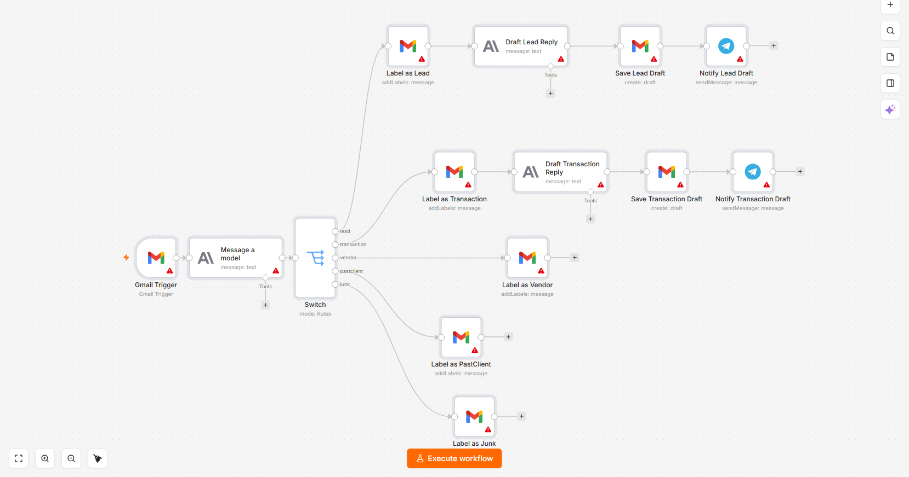
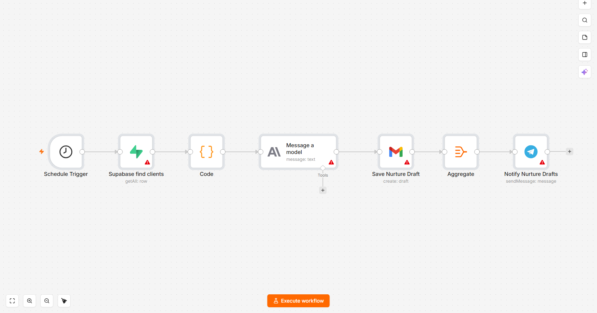
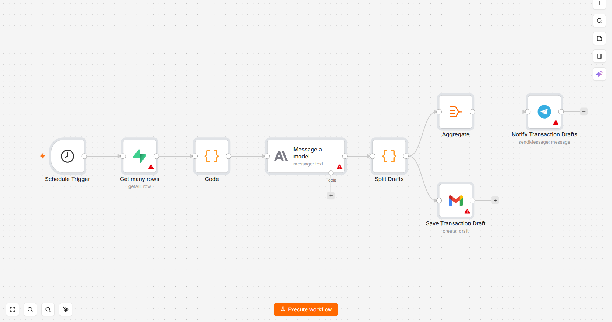
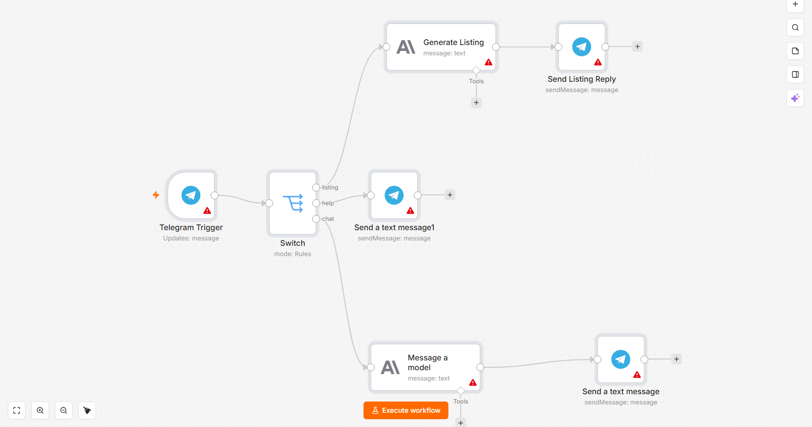
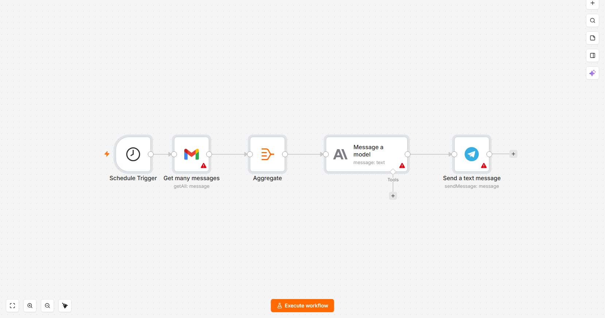
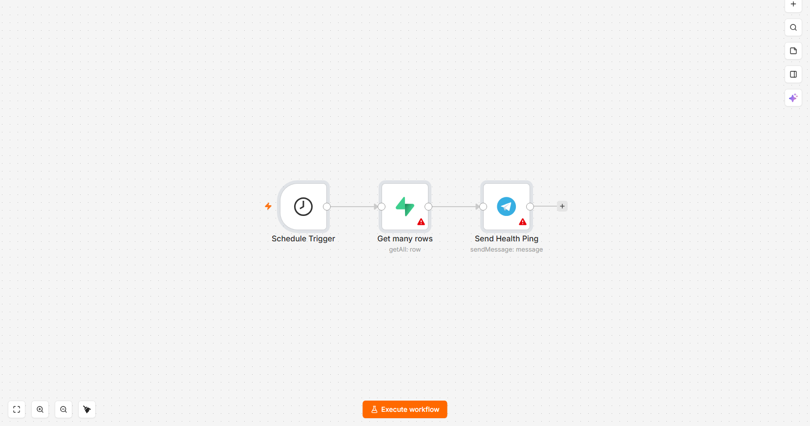
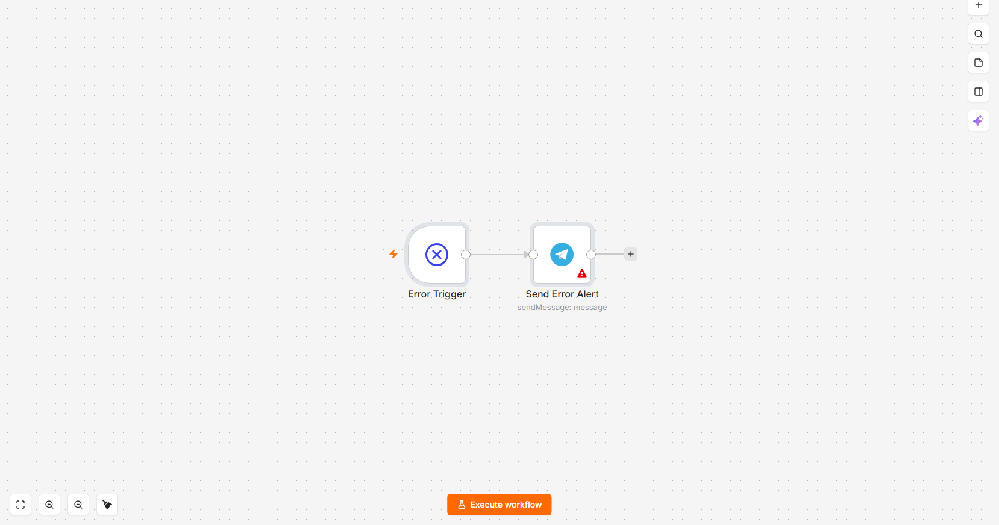

# AI Receptionist

An AI-powered virtual assistant/receptionist for a real estate agent's inbox
and client relationships, built as a set of [n8n](https://n8n.io) workflows.
It triages incoming email, drafts replies in the agent's voice, nurtures past
clients on a schedule, coordinates active transactions, and gives the agent
a Telegram-based assistant they can text on the go.

Built for an actual client's business - workflow exports here have all chat
IDs and personal contact info redacted/replaced with placeholders. No real
client names, records, or API keys are included; n8n exports never contain
credential secrets (those live in n8n's own credential store, referenced by
ID, not exported).

## What it does

- **Inbox Classifier** - every incoming email is read by Claude and sorted
  into `lead`, `transaction`, `vendor`, `pastclient`, or `junk`, labeled in
  Gmail automatically. Leads and active-transaction emails get an AI-drafted
  reply saved to Drafts (never auto-sent) and a Telegram notification so the
  agent can review and send.
- **Contact Nurture** - runs on a schedule, checks the client database
  (Supabase) for birthdays, home-purchase anniversaries, and clients who've
  gone quiet for 90+ days, and drafts a short, personal check-in message for
  each.
- **Transaction Coordination** - watches active deals for milestones
  (inspection tomorrow/today, follow-up needed, closing approaching) and
  drafts the right email to the right party automatically.
- **Telegram Brain** - a conversational assistant the agent can text
  directly: ask questions, get quick replies drafted, or send `/listing`
  with rough property notes to get a polished MLS description back.
- **Daily Inbox Digest** - a scannable morning summary of everything that
  came in overnight, grouped by category.
- **Health Check** - a scheduled heartbeat that pings the agent on Telegram
  if the system hasn't touched the database recently (silent-failure
  detection).
- **Error Trigger** - catches failures in any of the above and alerts the
  agent on Telegram instead of failing silently.

## Design choices worth calling out

- **Nothing sends automatically.** Every AI-drafted reply is saved to Gmail
  Drafts, not sent - the agent always reviews before anything goes out.
- **Voice, not vibes.** Every prompt has explicit, strict voice rules (no
  em dashes, no "I hope this finds you well," contractions required, sign
  off with `[Agent Name]` for the agent to fill in) so drafts read like the
  agent actually wrote them, not like a chatbot.
- **Fails loud, not silent.** A dedicated Error Trigger workflow and a
  separate Health Check heartbeat mean a broken workflow gets noticed in
  minutes over Telegram, not discovered a week later.

## Architecture

Actual n8n canvases, screenshotted from the imported workflows (not diagrams
drawn by hand) so the node types, icons, and connections match exactly what's
in the JSON exports below.

### Inbox Classifier

### Contact Nurture

### Transaction Coordination

### Telegram Brain

### Daily Inbox Digest

### Health Check

### Error Trigger

## Stack

- **[n8n](https://n8n.io)** - workflow orchestration
- **Claude (Anthropic)** - classification, drafting, summarization
- **Gmail API** - trigger on new mail, label, save drafts
- **Supabase** - client and transaction records
- **Telegram Bot API** - agent-facing notifications and chat interface

## Files

The `workflows/` folder contains the raw n8n workflow exports (JSON) for all
seven workflows described above. They can be imported directly into a
self-hosted or cloud n8n instance (Settings → Import from File), though
you'll need your own Gmail, Anthropic, Supabase, and Telegram credentials
configured in n8n first.
